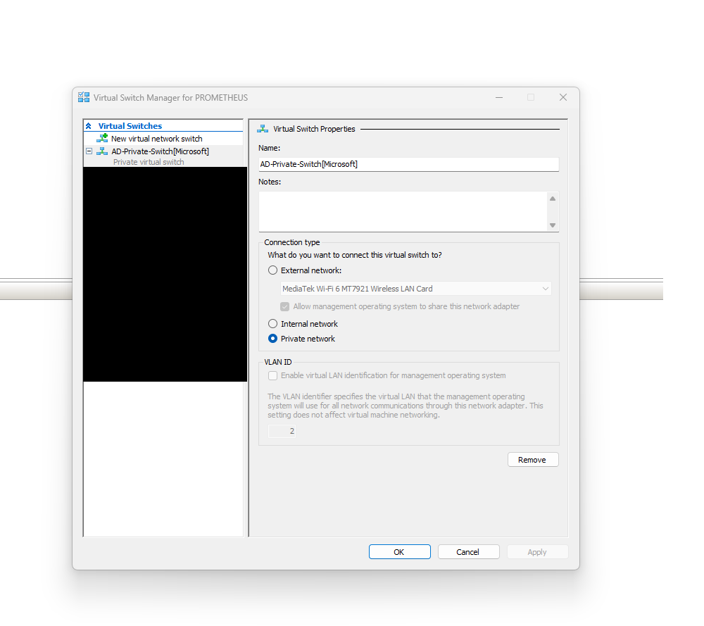
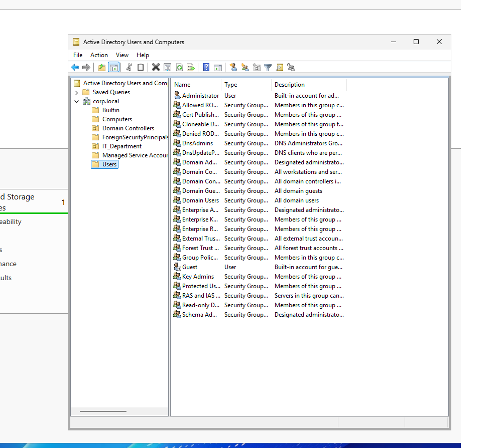
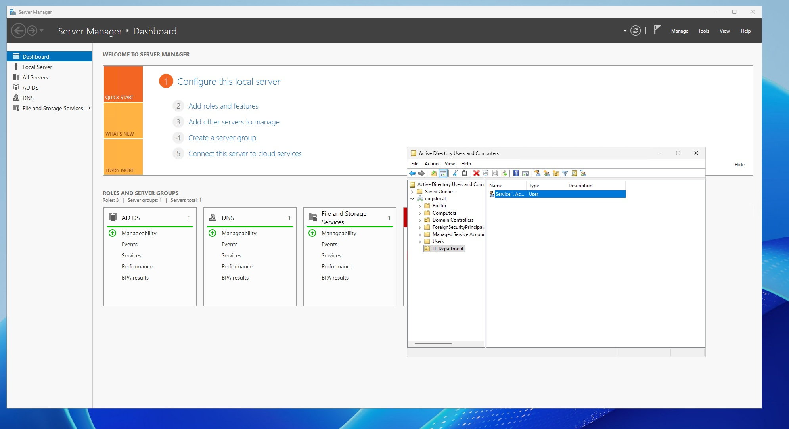
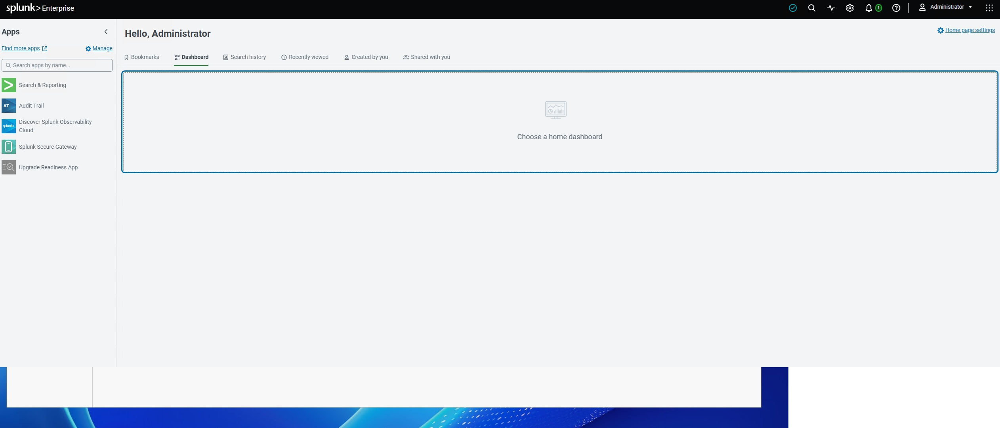
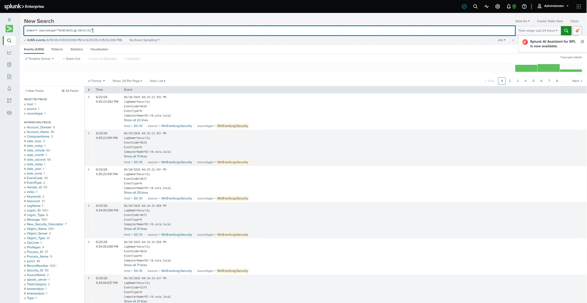
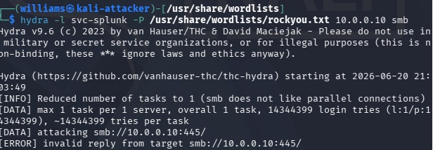
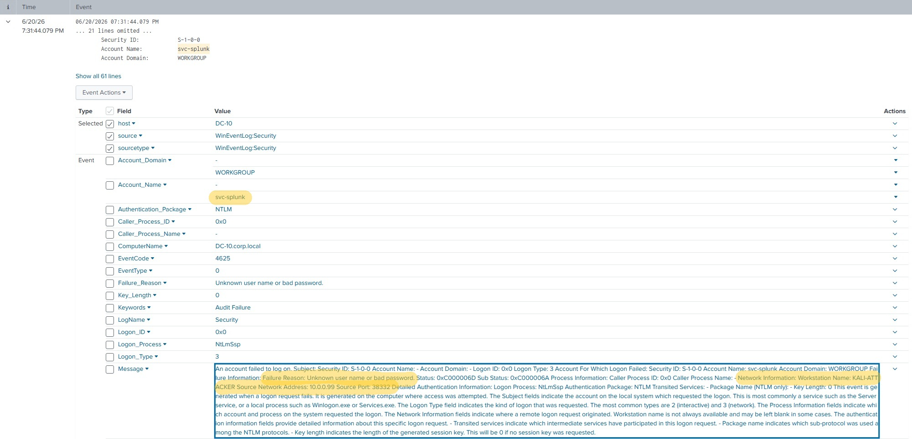
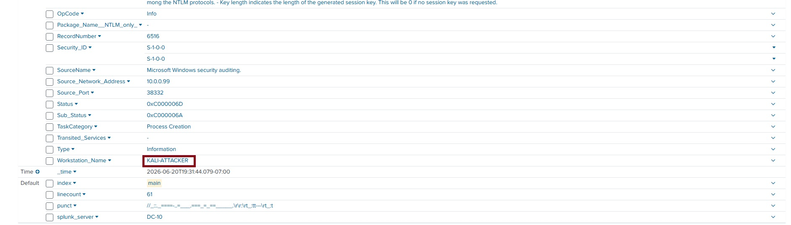
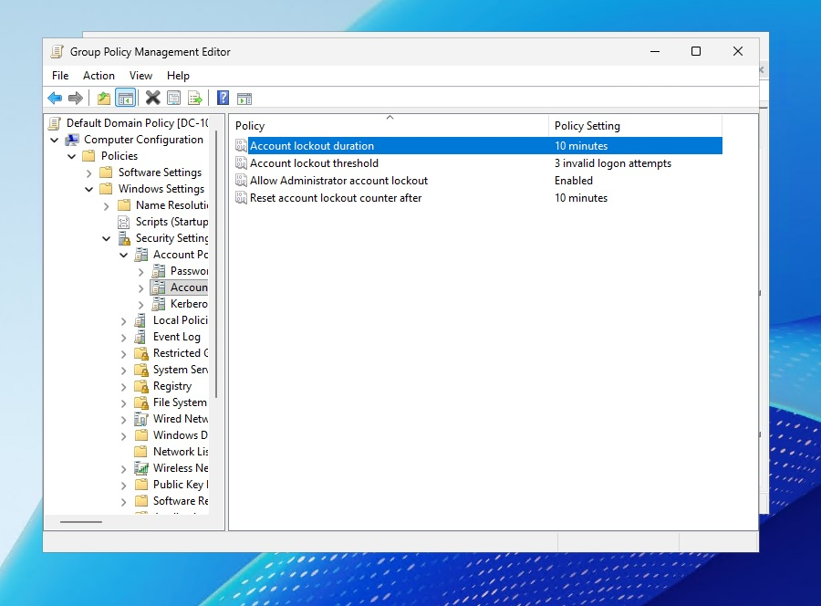

# Active Directory Enterprise Network & Splunk Detection Lab

## Overview
This project recreates a small enterprise network to practice setting up Active Directory, forwarding Windows logs, detecting attacks in Splunk, and applying defensive controls. The lab includes a Windows Server domain controller, a Windows 11 domain‑joined workstation, a Splunk Enterprise instance, and a Kali Linux attacker machine.

The goal was to build a realistic environment where I could generate authentication events, simulate attacks, and see how they appear in Splunk.

---

## Lab Architecture

- **Hypervisor:** Microsoft Hyper‑V  
- **Domain Controller:** Windows Server 2022 (10.0.0.10)  
- **Client:** Windows 11 Pro (domain‑joined)  
- **Attacker:** Kali Linux (10.0.0.99)  
- **SIEM:** Splunk Enterprise  
- **Logging:** Windows Event Forwarding (Security logs)

The entire setup runs on an isolated virtual switch so it stays separate from my home network.

---

## Phase 1 — Active Directory Setup

- Created an isolated virtual network in Hyper‑V  
- Installed Windows Server 2022 and promoted it to a Domain Controller  
- Set up the **corp.local** domain  
- Created Organizational Units and a service account (**svc‑splunk**)  
- Joined a Windows 11 machine to the domain  
- Verified authentication and domain functionality  

### Screenshots

**Isolated Network**

**Active Directory Tree**

**User Provisioning**

---

## Phase 2 — Splunk Log Collection

- Installed Splunk Enterprise locally  
- Configured Windows Event Forwarding to send Security logs to Splunk  
- Confirmed that authentication events and policy changes were being ingested  
- Verified that logs were updating in real time  

### Screenshots

**Splunk Deployment**

**Log Ingestion**

---

## Phase 3 — Attack Simulation & Detection

To test visibility, I used the Kali Linux machine to simulate failed authentication attempts.

### Attack
- Attempted SMB logins using incorrect credentials for the **svc‑splunk** account  
- This generated multiple **Event ID 4625 (Failed Logon)** entries on the Domain Controller  

### Detection in Splunk
Using Splunk searches, I was able to identify:

- The attacker’s IP address (10.0.0.99)  
- The targeted username  
- Logon type  
- Failure reason  
- The host that logged the event  

This confirmed that Splunk was receiving and displaying the data needed to detect brute‑force or password‑spraying attempts.

### Screenshots

**Kali Attack Simulation**
### 

**Splunk Attack Detection**

**Splunk Attack Detection (Additional View)**

---

## Phase 4 — Defensive Hardening

To reduce the risk of repeated failed logons, I updated Group Policy:

- Edited the **Default Domain Policy**  
- Set the **Account Lockout Threshold** to **3 failed attempts**  
- Applied and verified the policy  

### Screenshots

**Group Policy Remediation**

---

## Skills Demonstrated

- Windows Server and Active Directory setup  
- Windows 11 domain configuration  
- Windows Event Forwarding  
- Splunk installation and log ingestion  
- Authentication event analysis  
- Basic attack simulation  
- Group Policy hardening  
- Event correlation and detection  

